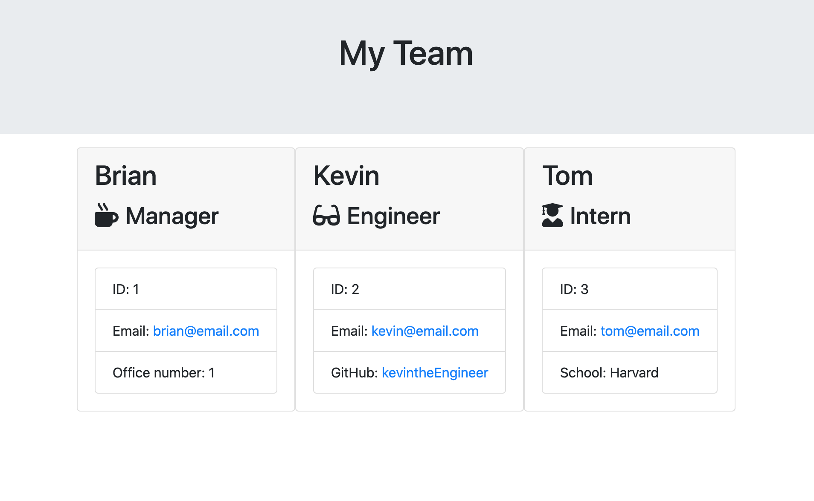

# Office Team Generator
<hr>

[](https://opensource.org/licenses/MIT)

## Description

Quick and easy way to create an HTML containing a team with its members and important information.



### Table of Contents

*[Installation](#installation)

*[Usage](#usage)

*[Process](#process)

*[License](#license)

*[Contributing](#contributing)

*[Questions](#questions)

## Installation

To install necessary dependencies, run the following command:

```
  npm install
```


## Usage
 
To use the application run an integrated terminal within the develop directory. 

*Run the below code in the integrated terminal to begin*

```
  node app.js
```

The user will be prompted with a series of questions. Answer them and run the team.html file in a browser.

## Process

### Test Files and Classes

#### Test Files

A develop directory was given with many instantiated files. Under the test directory, there are four .test.js files.
Based on these files, corresponding classes could be made. Once each class passed all tests, the next step can be taken.

*To run tests, the below code is implemented*
```
  npm test
```

#### Classes

When creating classes, it could be determined that some classes could inherit properties from another class. Employee seems to be the most general and intuitively spans over Engineer, Intern, and Manager. As a result, Employee became a super class and the remaining classes extended it.

### Inquirer

Inquirer is used to prompt the user and receieve the user inputs.
*the below code is a sample of how to prompt the user for a username*

```bash
return inquirer.prompt([
    {
      type: "input",
      name: "username",
      message: "What is your GitHub username?"
    }
```

Different prompt functions are required when users select different office roles. 
*ie: An intern is prompted for school whereas a engineer is prompted for github username*

### Creating the HTML

An HTML template for each employee type can be created. By replacing values such as name, id, etc from the templates, an HTML specific to an employee is generated.

An array of employees can be created by pushing a new employee to an array every time inquirer finishes a prompt function. After creating the full array of employees, the array is passeed into the render function where each employee is sorted by role and a corresponding template is made for each one. The HTML contents are joined together into one HTML. That HTML can then be written into a new file called team.html.
Once this has been completed, the program has completed its task.

## License

This Project is licensed under the MIT License


## Built With:
* [HTML](https://developer.mozilla.org/en-US/docs/Web/HTML)
* [JS](https://developer.mozilla.org/en-US/docs/Web/JS)
* [Node](https://developer.mozilla.org/en-US/docs/Web/API/Node)
* [Bootstrap](https://developer.mozilla.org/en-US/docs/Glossary/Bootstrap)


## Author(s):
**Brian Lee**
* [GitHub](https://github.com/brianjunhyuplee)
* [LinkedIn](https://www.linkedin.com/in/brian-lee-559208187/)


## Questions

If you have any questions about the repo, open an issue or contact me directly at [brianjunhyuplee@gmail.com](brianjunhyup@gmail.com). You can find more of my work at [brianjunhyuplee](https://github.com/brianjunhyuplee). 
    